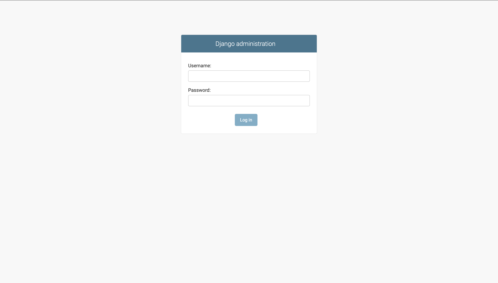

# Aplikacje internetowe

## laboratorium pierwsze

Powyższe repozytorium jest relaizacją zadań dostępnych [tutaj](https://zacniewski.gitlab.io/teaching/2020-internet-apps/)

Wersja produkcyjna aplikacji znajduje się na [heroku](https://fast-bastion-31270.herokuapp.com)

### zrzuty ekranów

*logowanie do panelu administratora*

*panel administratora*

*lista postów*

*szczegóły posta*

*edycja posta*

*nowy post*
