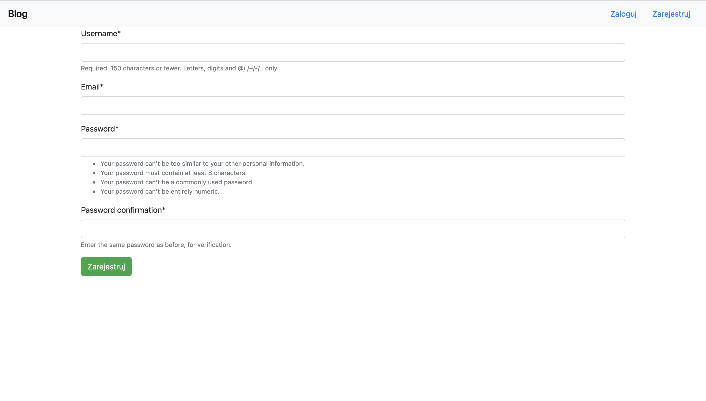
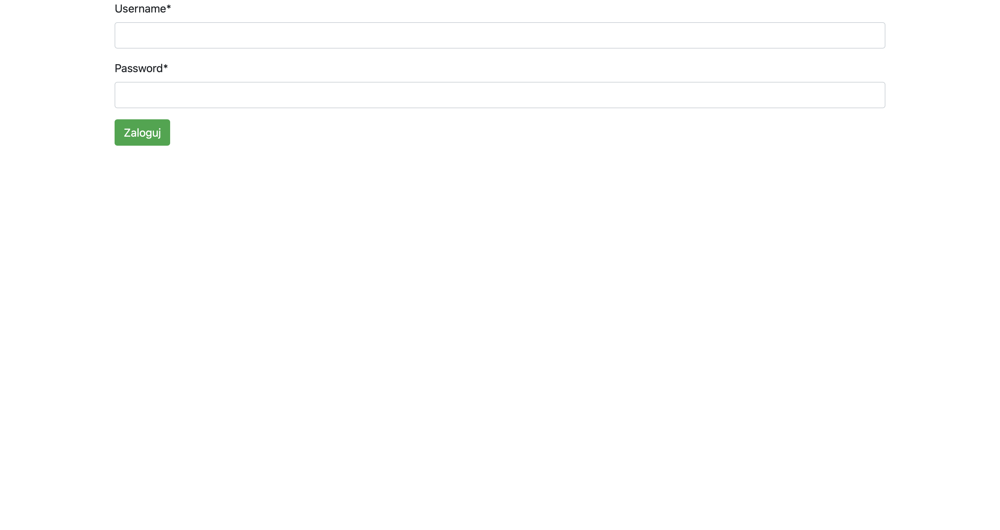
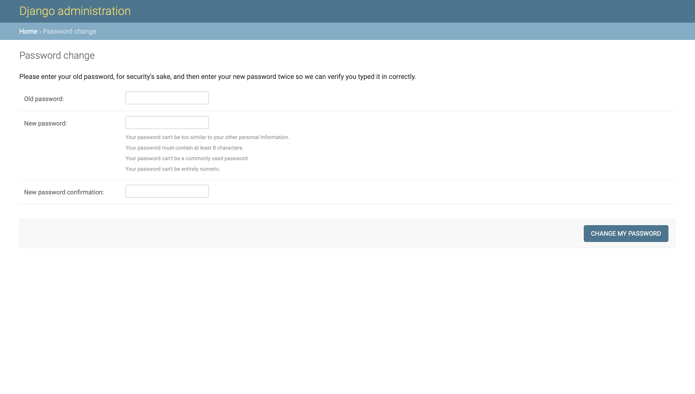
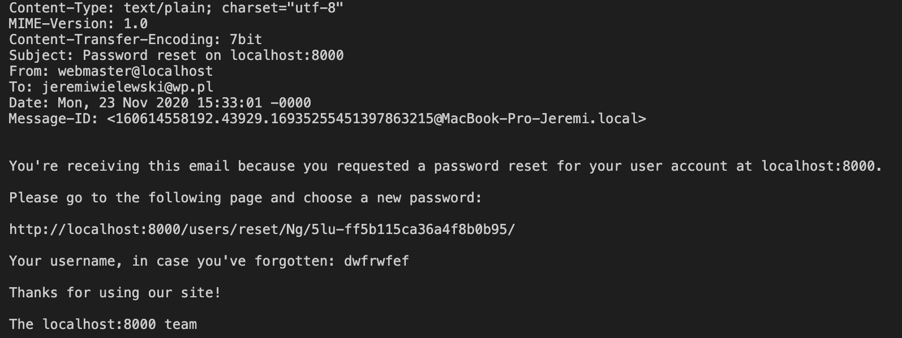
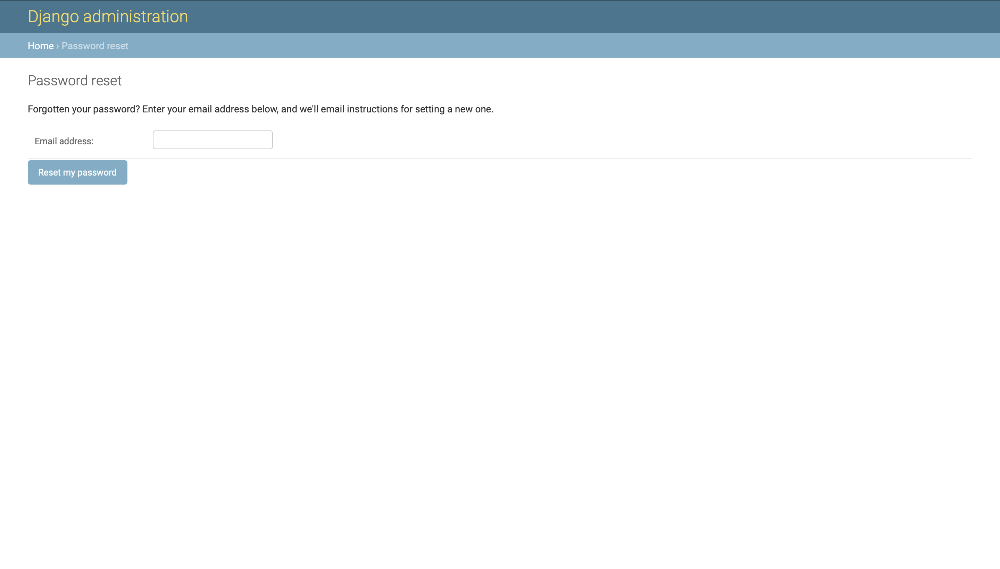

# Aplikacje internetowe

## laboratorium pierwsze

Powyższe repozytorium jest relaizacją zadań dostępnych [tutaj](https://zacniewski.gitlab.io/teaching/2020-internet-apps/)

### zrzuty ekranów

*rejestracja*

*logowanie*

*zmiana hasla*

*potwierdzenie zmiany hasła*

*resetowanie hasła*
