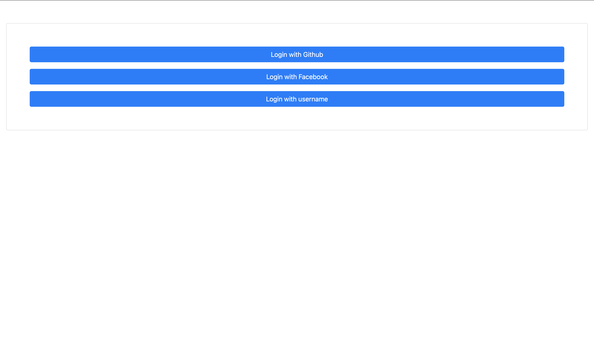
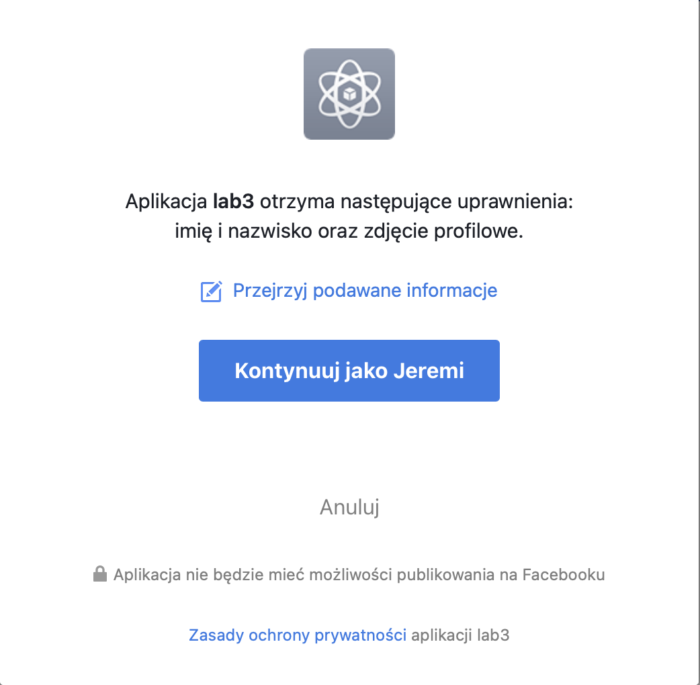
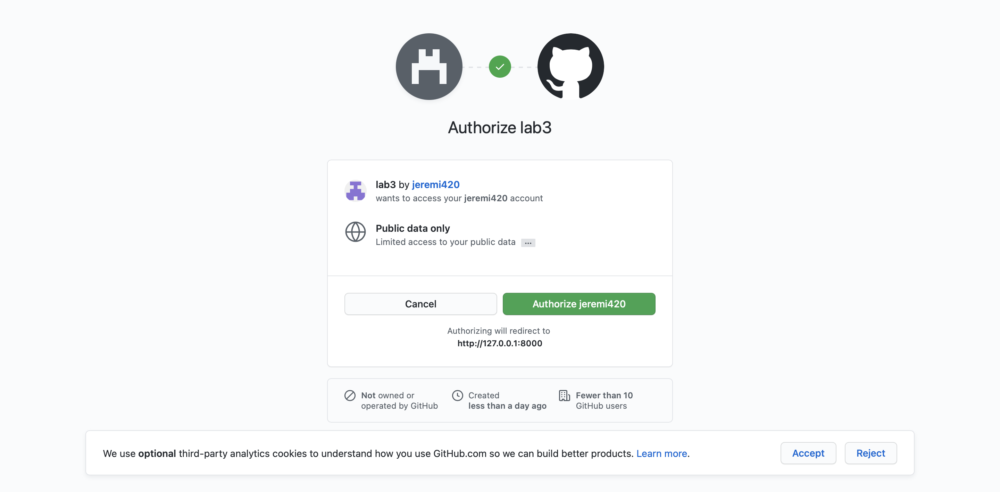
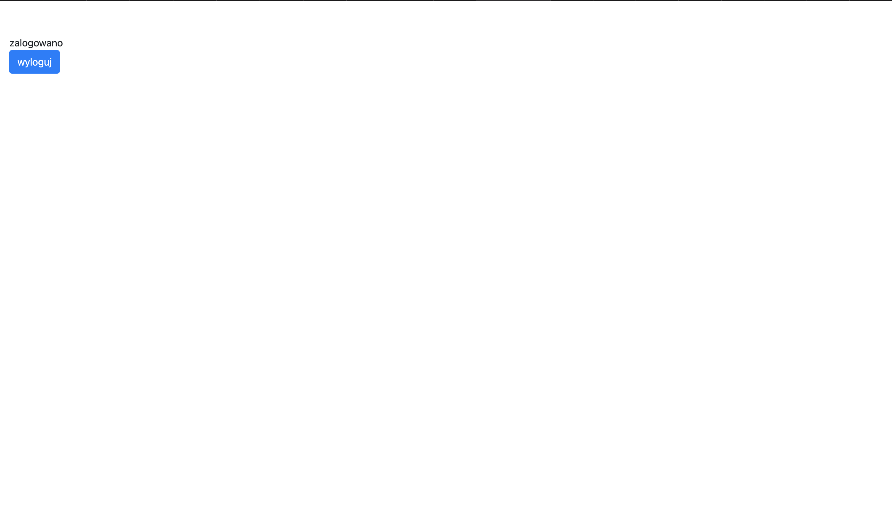

# Aplikacje internetowe

## laboratorium trzecie

Powyższe repozytorium jest relaizacją zadań dostępnych [tutaj](https://zacniewski.gitlab.io/teaching/2020-internet-apps/)

### zrzuty ekranów

*strona główna*

*logowanie za pomocą facebooka*

*logowanie za pomocą githuba*

*logowanie za pomocą nazwy użytkownika*

*ekran dla zalogowanego użytkownika*
