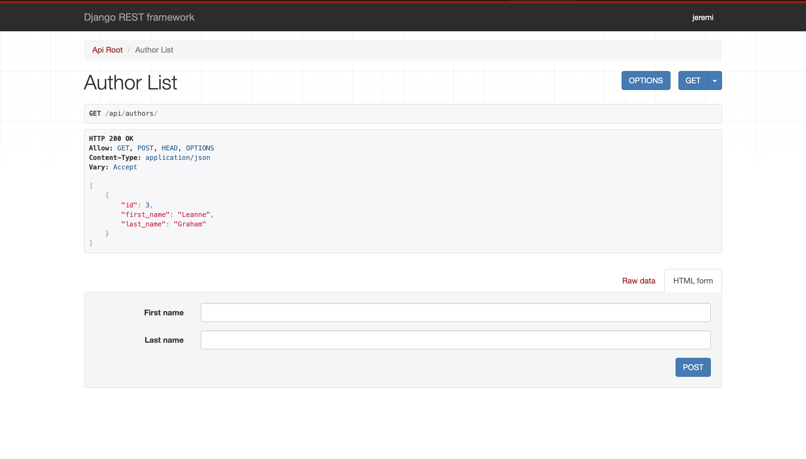

# Aplikacje internetowe

## laboratorium czwarte

Powyższe repozytorium jest relaizacją zadań dostępnych [tutaj](https://zacniewski.gitlab.io/teaching/2020-internet-apps/)

W ramach danych testowych dodałem jednego autora który stworzyŻ dwa posty. oba posty mają po trzy komentarze.

Dostępne ścieżki:

-   /authors - lista wszystkich autorów
-   /authors/id - wybrany autor
-   /authors/id/posts - posty wybranego autora
-   /posts - lista wszystkich postów
-   /posts/id - wybrany post
-   /posts/id/comments - komentarze wybranego posta
-   /comments - lista wszystkich komentarzy

### zrzuty ekranów

_/authors_

_/authors/id_

_/authors/id/posts_

_/posts_

_/posts/id_

_/posts/id/comments_

_/comments_
