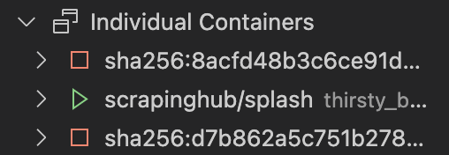
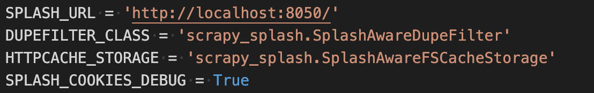
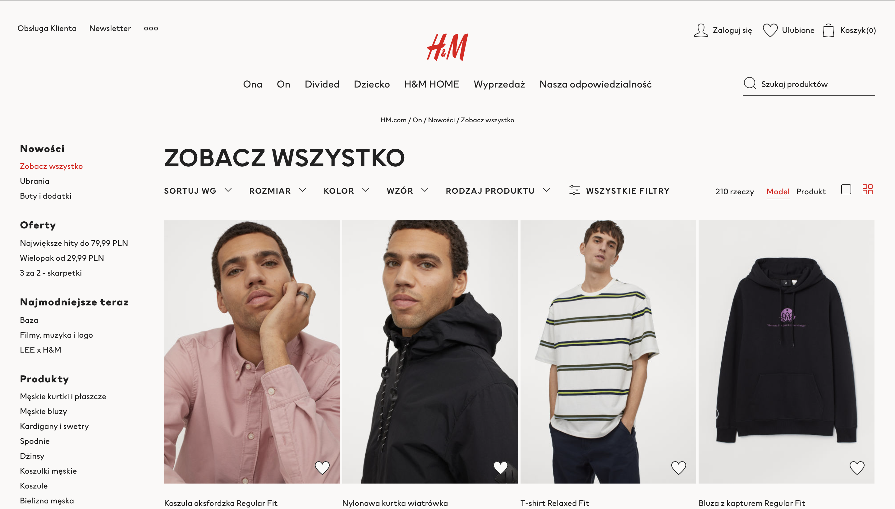
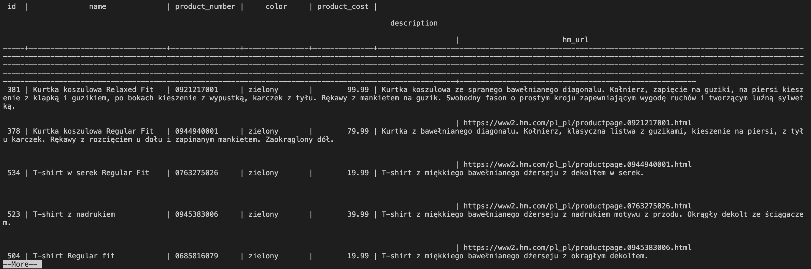
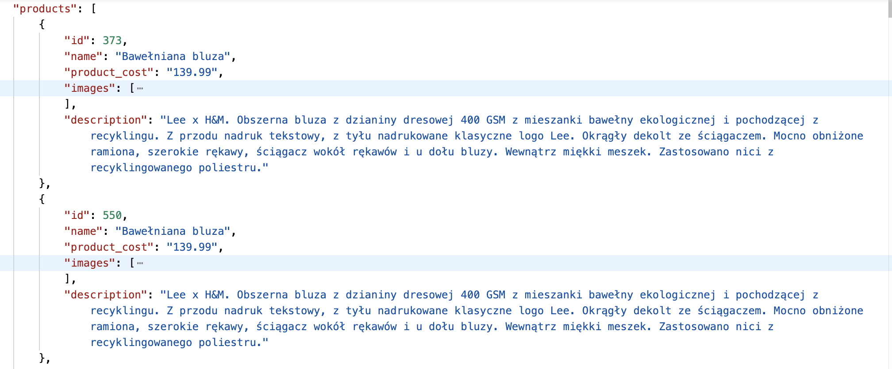
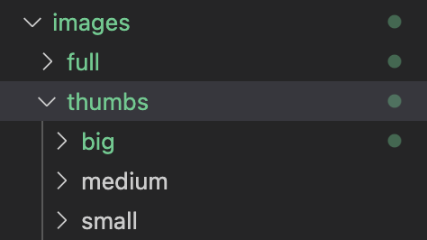
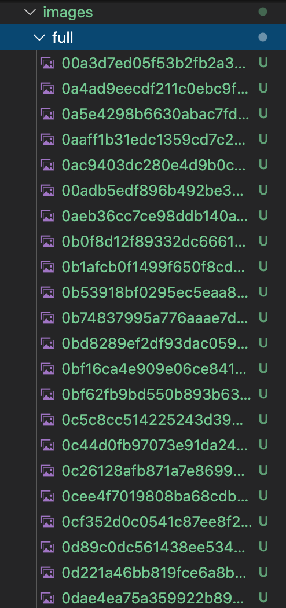

# Aplikacje internetowe

## laboratorium piąte

Scrapper który pobiera dane ze strony hmu napisany w pythoniu w oparciu o technologię scrappy.

## web scrapper strony hmu

### dynamiczna zawartość strony

Strona hmu jest renderowana dynamicznie, więc musiałem użyć silnika do renderowania zawartości javascript. Mój wybór padł na technologię "splash js". Przeglądarkę uruchomiłem loklanie jako kontener dockera.

Ustawienia dla tej technologii znajdują się w pliku settings.py

### parsowanie produktów

Aby rozpocząć pobieranie informacji o produktach musiałem zacząc od listy zawierającej linki do odpoiwednich podstron. Zadanie okazało się być nietrywialne ponieważ strona ta nie posiada "globalnej" listy produktów. Zdecydowałem się na użycie listy nowych produktów dla mężczyzn. W przyszłości chcę dodać pobieranie informacji o wszystkich dostępnych listach ze strony głównej.

Po udanym pobraniu informacji o produktach stworzyłem klasę typu "pipeline" która pozwala określać co się następnie stanie z informacjami (plik ). postanowiłem je umieścić w bazie postgresql za pomocą klasy ProductSavePipeline.

Napisałem również serwis który udostępnia nam produktu w formacie JSON (nie znajduje się w projekcie).

### obrazki

Technologia scrapy pozwala w łatwy sposób pobierać obrazki za pomocą klasy ImagesPipeline. Pobrałem wszystkie obrazki dla wybranych produktów, a dodatkowo utworzyłem ich miniaturki w 3 różnych rozmiarach.

Do przechowywania informacji o obrazkach została utworzona oddzielna tabela w bazie danych.

### kolory

Nie wszystkie informacje o produkcie są dostępne z jego podstrony. Przykładowo nie znajdziemy tam informacji o kolorze produktu, który jest dostępny jako jedna z opcji filrowania z widoku listy. Z tego powodu musiałem cofnąć się do listy, a następnie wysłać żądanie dla poszczególnej opcji. Dla koloru beżowego url żądania będzie zawierał parametr "?colorWithNames=beżowy". Następnie pojawi nam się lista produktów danej kategorii. Teraz możemy znaleźć odpowiednie produkty w bazie danych na podstawie adreu url podstrony i nadać im odpowiedni kolor. Aby to zrobić potrzebny był kolejny crawler uruchamiany po umieszczeniu produktów w bazie danych znajdujący się w pliku spiders/colors.py
