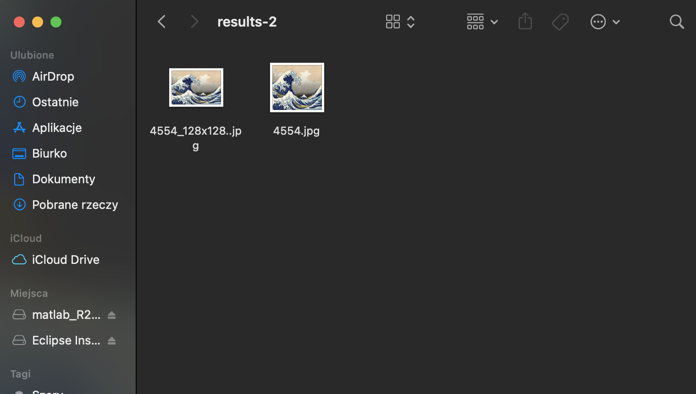

# Aplikacje internetowe

## laboratorium siódme

repozytorium jest implementacją przykładu https://stackabuse.com/asynchronous-tasks-in-django-with-redis-and-celery/.

### zrzuty ekranów

uruchomiony lokalnie serwer redisa.

uruchomiony lokalnie serwer celery.

interfejs strony internetowej.

wybieranie obrazu.

utworzona miniaturka.

