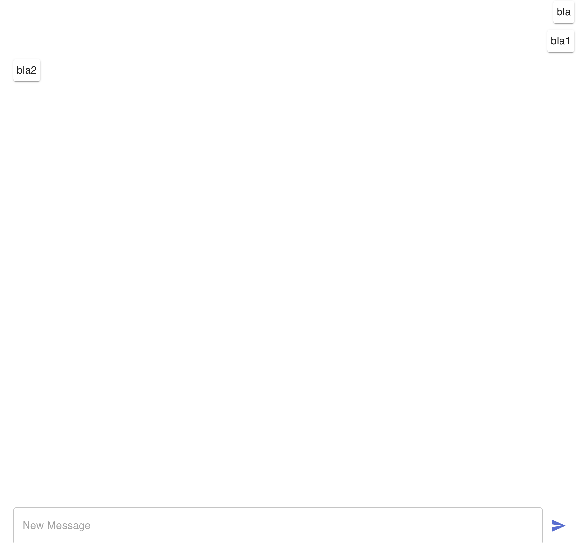
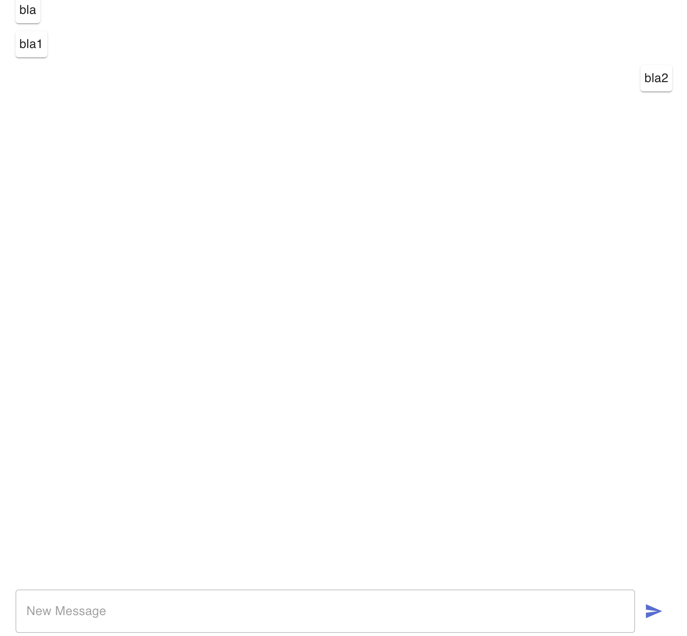
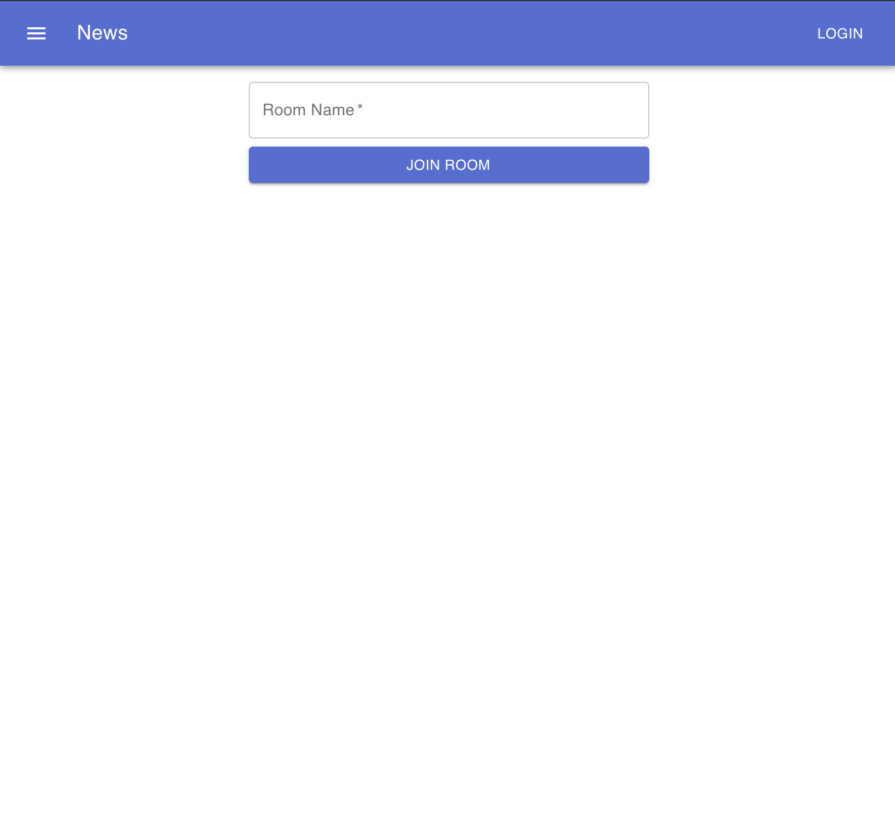
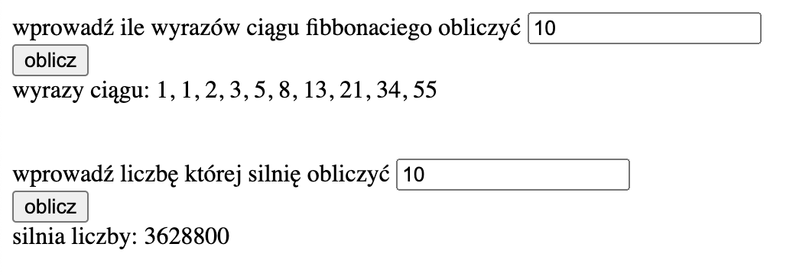

# Aplikacje internetowe

## laboratorium ósme

### część pierwsza

Stworzyłem prosty chat z wykorzystaniem reacta jako frontendu oraz node js jako backendu.

Wiadmości obecnego użytkownika wyświetlane są po prawej stronie ekranu, a wszystkihc pozostałych użytkowników - po lewej. Dodatkow dodałem opcję wyboru pokoju chatu.

### część druga

zdecydowałem się na zaimplementowanie workerów obliczających nty wyraz ciągu fibonacciego oraz silnie podanej liczby.

Aby móc zaimportować workery zlokalnych plików musiałem użyć flagi "--allow-file-access-from-files" w przeglądarce google chrome.

worker z ciągiem fibonnaciego generuje kolejne wartości co pół sekundy (za pomocą funkcji setTimout). Ma to na celu pokazanie że wartości mogą być generowane w czasie rzeczywistym (idea podobna do generatorów).
