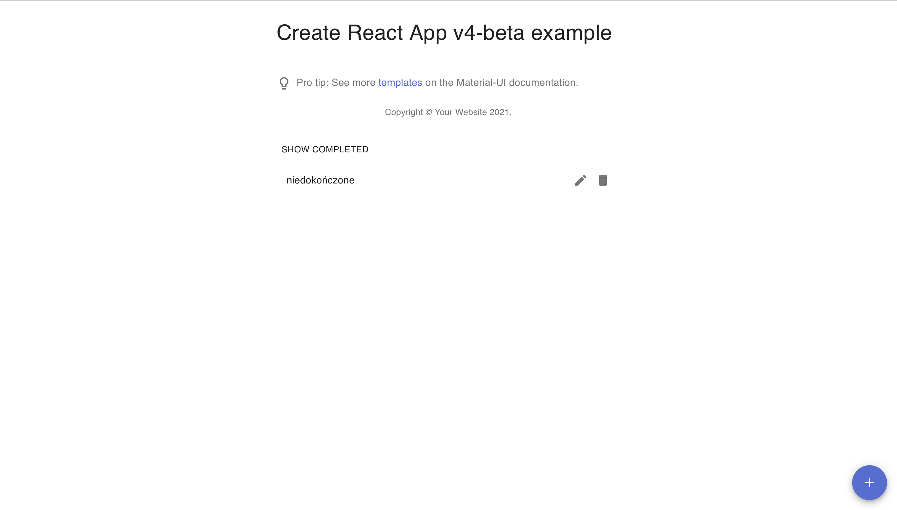
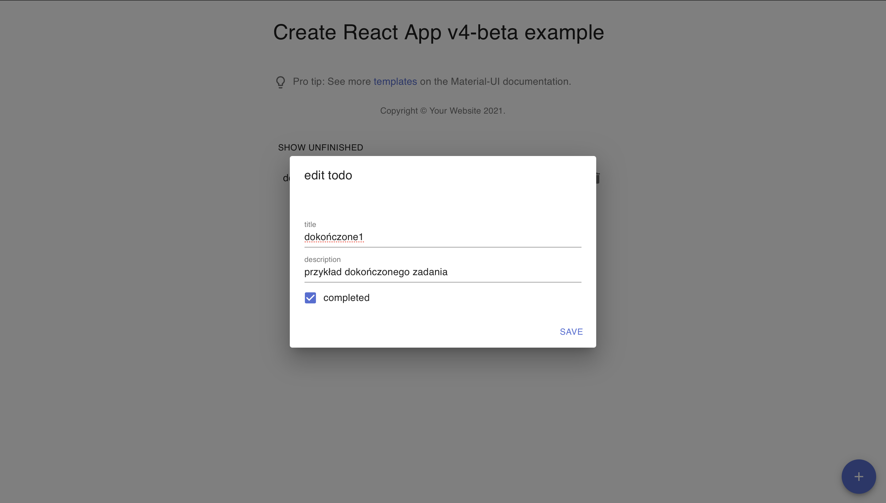

# Aplikacje internetowe

## laboratorium dziewiąte i dziesiąte

jest to aplikacja typu todo z wykorzystaniem reacta i django. Strona w reactcie konsumuje endpointy CRUD wystawione przez backend.

### dodawanie nowych przedmiotów

Na potrzeby poradnika zaczynam od pustej listy i dodaję wykonane zadanie.

Po dodaniu przedmitu, lista jest aktualizowana tak abyśmy mieli bieżący podgląd danych z serwera.

### filtrowanie przedmiotów

Aplikacja pozwala na filtorwanie zadań, tak abyśmy widzieli jedynie dokończone lub niedokończone.

### edycja przedmiotów

Podobnie jak przy dodawaniu, lista odświerza się po modyfikacji.

### usuwanie

Ciżeko to pokazać na zdjęciu ale po nacisnieciu ikony smietnika usuwa się przedmiot.
